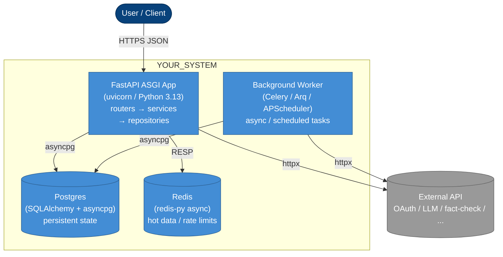

# Container diagram — C4 Level 2

> **Specification perspective.** This is one level deeper than
> `overview.md`. Here we name the runnable containers (API, worker,
> database, cache) and the responsibilities each takes. Frameworks
> and concrete technologies ARE named at this level.
>
> Still not at Code level — `containers.md` doesn't show classes.
> That's Level 3 (components) — deferred to the code itself unless a
> system is exceptionally complex.

## Diagram

## Containers

One row per box in the diagram.

| Container | Technology | Responsibility |
|---|---|---|
| API | FastAPI on uvicorn, Python 3.13 | ASGI endpoints, Pydantic validation, orchestrate services, call DB + external APIs |
| Background Worker | Arq / Celery / APScheduler | Scheduled jobs, async batches, webhook retries |
| Database | Postgres 16 (SQLAlchemy 2.x async + asyncpg) | Persistent state, transactional integrity |
| Cache | Redis (redis-py async) | Session cache, rate-limit counters, hot keys |

Delete any row that isn't used. Library/CLI archetypes typically have
only the API row (or none at all if the package is purely offline);
Data-science archetypes often replace the whole row set with a single
"Pipeline runner" entry.

## Boundary rules (enforced by Import Linter)

Each container maps to the package layers it's allowed to exercise.
The Import Linter contracts in `examples/.importlinter` codify these:

- **API** (`routers/*`): HTTP layer only. Must go through `services/` —
  routers cannot import `repositories/` or `models/` directly
- **Worker** (`workers/*` or `dependencies/scheduler.py`): same
  discipline; triggered by cron / queue instead of HTTP
- **`services/`**: business logic. Cannot import `sqlalchemy`,
  `fastapi`, or `httpx` — framework-agnostic so logic can be reused
  by Worker, tested with pure unit tests, and ported if the framework
  changes
- **`repositories/`**: SQLAlchemy session work only; does not know
  HTTP
- **`schemas/`**: Pydantic DTOs + `ErrorResponse`; importable by
  `routers/`, `services/`, tests
- **`core/`**: `config`, `database`, `exceptions`, `logging`,
  `context` — importable by every layer (cross-cutting)
- **`models/`**: SQLAlchemy ORM classes; imported by `repositories/`
  only, never by routers / services directly

## Deployment notes

- API is the primary deployment target; Worker runs as a separate
  process (separate container, same codebase). In small systems both
  can run in one process with `@app.on_event("startup")` scheduling
- DB is a managed service (RDS, Supabase, Neon, Cloud SQL). Use
  Alembic for migrations — `alembic/versions/` is the historical
  record
- Cache is managed (ElastiCache, Upstash, Redis Cloud). Never run
  local Redis in production

## When to update this file

- A new container is added (e.g. a separate background worker split
  off from the API)
- A container's technology changes (e.g. Postgres → CockroachDB,
  Celery → Arq)
- A dependency edge is added or removed
- An ADR lands that shifts the architecture

Changes to this diagram without a corresponding ADR are a red flag —
architecture shifts should be deliberate decisions, not incidental edits.
